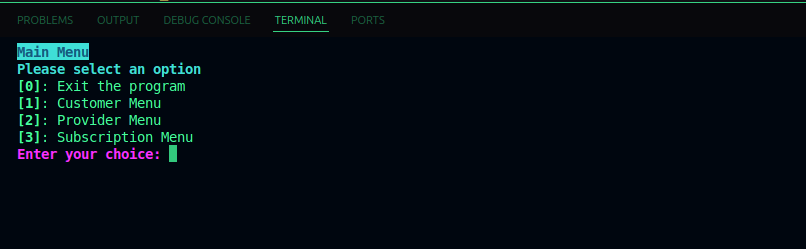
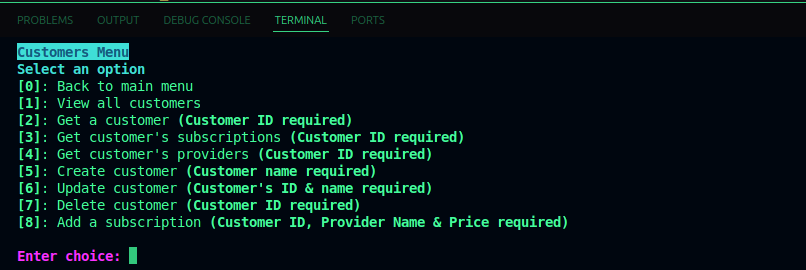
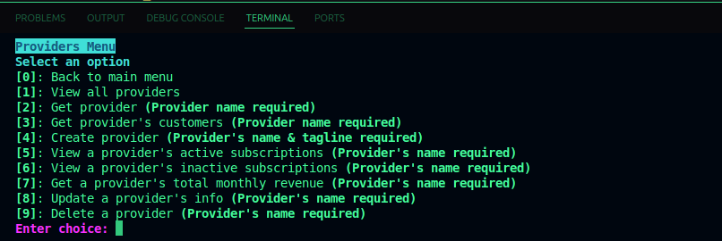
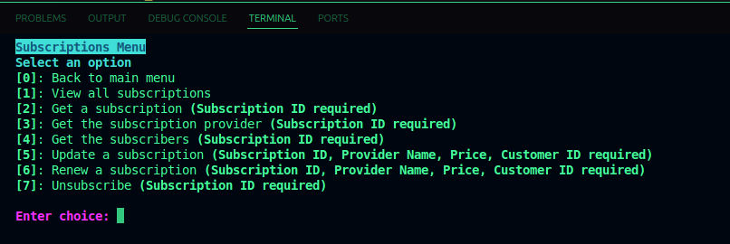

# TV Service Management System

A Python-based CLI application for managing TV service providers, customers, and their subscriptions. Built using Python, SQLAlchemy and SQLite.

## Features

- Create, update, and delete TV service providers
- Track active and inactive customer subscriptions
- Retrieve provider-specific customers and subscription stats
- Calculate total revenue per provider
- Alembic-powered database migrations
- Clean command-line interface

## Technologies used
- Python 3.8.13
- SQLAlchemy (ORM)
- SQLite (Database)
- Alembic (Migrations)
- Git (Version Control)

## Setup Instructions
1. Clone the repository and navigate to its directory
```bash
git clone git@github.com:mbxisbankai/tv-service-management-system.git
cd tv-service-management-system/
```
2. Set up the virtual environment using pipenv
```bash
pipenv install && pipenv shell
```

## Usage
Run the CLI
```bash
cd tv-service-project/
python cli.py
```
## Interface

### Main Menu


### Customer Menu


### Provider Menu


### Subscription Menu
